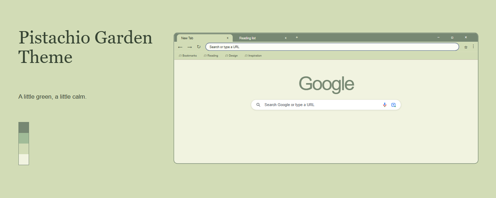
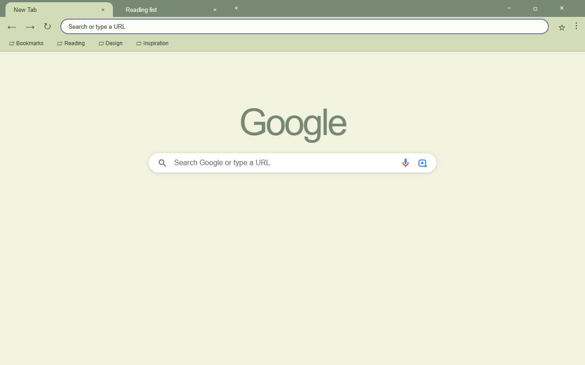
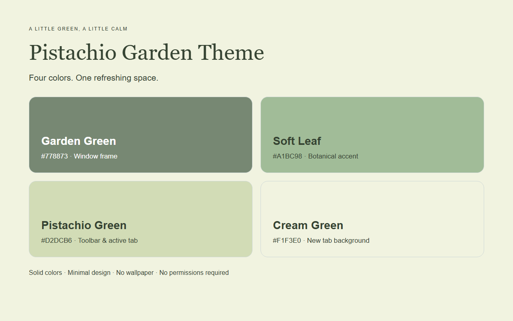

# Pistachio Garden Theme

> 开心果花园 · A little green, a little calm.

A gentle Chrome theme built around pistachio green, soft cream, and muted garden tones. Pure, flat colors — no wallpaper, gradient, or texture — with a clear light-to-dark layering that keeps the browser calm and readable.

[](store-assets/promo/1400x560.png)

---

## Preview · 预览

| Browser | Introduction |
| --- | --- |
|  |  |

- **screenshot-1-browser.png** — the browser in action: muted green frame, soft pistachio toolbar, and the bookmarks bar.
- **screenshot-2-introduction.png** — the theme introduction with the four base colors and their roles.

> Store previews are rendered from a real Chromium session. After installing the theme, the exact rendering follows your own browser and OS.

---

## Color palette · 配色

| Color | Role · 用途 |
| --- | --- |
| `#778873` | Frame of the active and inactive window; resting background of the window buttons |
| `#D2DCB6` | Active tab, toolbar, and bookmarks bar |
| `#F1F3E0` | New Tab page background |
| `#A1BC98` | Brand accent and introduction color block |
| `#354332` | Text, links, and toolbar icons |
| `#FCFDF7` | Omnibox (address bar) background |

The active and inactive window frames share the same color on purpose, so switching windows never reveals a second color scheme. Window button icons and their hover states are drawn by Chrome / your OS — confirm them after install. The Google logo uses the single-color theme mechanism, so its generated tint follows your actual Chrome.

---

## Install · 安装

**From the Chrome Web Store**
1. Open the theme's store page.
2. Click **Get started**, then confirm the install in the dialog.
3. The theme applies instantly.

**Load unpacked (for development / local preview)**
1. Open `chrome://extensions` and enable **Developer mode**.
2. Click **Load unpacked** and select this folder.
3. The theme applies immediately; reload to pick up any change.

> Your color choices and any local settings stay in your browser and are never uploaded to a remote server.

---

## Logo

A pistachio kernel peeking from a half-open shell with a small leaf — a simple, flat mark. Deep gray-green body, light-green accent, on a rounded cream-green square with transparent corners outside the rounded shape. Only `logo/logo128.png` (128×128) is referenced by the manifest.

---

## Project structure · 目录结构

```
pistachio-garden-theme/
├─ manifest.json                 # Theme manifest (MV3)
├─ logo/logo128.png              # Theme icon
├─ README.md
├─ PACKAGING.md
├─ scripts/                      # Asset generation & packaging
│  ├─ generate-store-assets.py   # Screenshots & promo (headless Chromium)
│  ├─ generate-references.py
│  └─ package.ps1                # Build the release ZIP
└─ store-assets/
   ├─ screenshots/en/            # Store screenshots (English)
   ├─ promo/                     # 440×280 and 1400×560 promo images
   └─ store-description.txt      # Store listing description
```

---

## Packaging · 打包

Run the packaging script to build a complete release ZIP with `manifest.json` at the archive root:

```powershell
powershell -File scripts/package.ps1 -Force
```

The output lands in the default folder `D:\迅雷下载\vibe coding` as `pistachio-garden-theme-1.0.0.zip`. Use `-Force` to overwrite an existing archive of the same version.

---

## License

Non-Commercial License. See the store listing for details.
