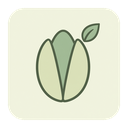
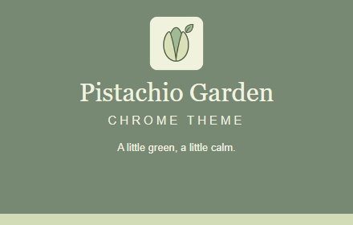

<div align="center">
  
</div>

<h1 align="center">Pistachio Garden Theme</h1>

<p align="center"><strong>开心果花园 · A little green, a little calm.</strong></p>

<p align="center">
  
  
  
</p>

<p align="center">
  
</p>

A gentle Chrome theme built around pistachio green, soft cream, and muted garden tones. Pure, flat colors — no wallpaper, gradient, or texture — with a clear light-to-dark layering that keeps the browser calm and readable.

---

## Features · 特性

- **Flat solid colors.** No wallpaper, no gradient, no texture — every surface is a single flat tone.
- **One consistent frame.** Active and inactive window frames share the same green, so switching windows never reveals a second color scheme.
- **Three-level layering.** Deep green frame on the outside, pistachio toolbar in the middle, and a cream New Tab page in the middle of the screen — depth without noise.
- **Readable by default.** Deep green text, icons, and links keep their contrast on every light surface.
- **Single-color Google logo.** The New Tab wordmark uses Chrome's theme mechanism (`ntp_logo_alternate`) instead of a fixed asset.
- **Theme only.** `manifest.json` declares a `theme` block and nothing else — no scripts, no content styling, no request to read the pages you visit.

---

## Preview · 预览

### Store screenshots · 商店截图 1280×800

**Browser interface** — the browser in action: muted green frame, pistachio toolbar, and the bookmarks bar.


**Palette & highlights** — the theme introduction with the base colors and their roles.


### Promo tiles · 宣传图

**Marquee tile — 1400×560**


**Small tile — 440×280**



> Store previews are rendered from a real Chromium session and calibrated to the installed Chrome look. After installing the theme, the exact rendering follows your own browser and OS.

---

## Color palette · 配色

| Color · 色值 | Role · 用途 |
| --- | --- |
| `#778873` | Frame of the active and inactive window; resting background of the window buttons |
| `#D2DCB6` | Active tab, toolbar, and bookmarks bar |
| `#F1F3E0` | New Tab page background |
| `#A1BC98` | Brand accent and introduction color block |
| `#354332` | Text, links, and toolbar icons |
| `#FCFDF7` | Omnibox (address bar) background |

Window button icons and their hover states are drawn by Chrome / your OS — confirm them after install.

---

## Install · 安装

**From the Chrome Web Store**

1. Open the theme's store page.
2. Click **Get started**, then confirm the install in the dialog.
3. The theme applies instantly.

**Load unpacked (for development / local preview)**

1. Open `chrome://extensions` and enable **Developer mode**.
2. Click **Load unpacked** and select this folder.
3. The theme applies immediately; reload to pick up any change.

> Your color choices and any local settings stay in your browser and are never uploaded to a remote server.

---

## Logo

A pistachio kernel peeking from a half-open shell with a small leaf — a simple, flat mark. Deep gray-green body, light-green accent, on a rounded cream-green square with transparent corners outside the rounded shape. Only `logo/logo128.png` (128×128) is referenced by the manifest, and the same file is used for the repository and the store listing.

---

## Project structure · 目录结构

```
pistachio-garden-theme/
├─ manifest.json                 # Theme manifest (MV3)
├─ logo/logo128.png              # Theme icon
├─ README.md
├─ PACKAGING.md
├─ scripts/                      # Asset generation & packaging
│  ├─ generate-store-assets.py   # Screenshots & promo (headless Chromium)
│  ├─ generate-references.py
│  ├─ requirements.txt
│  └─ package.ps1                # Build the release ZIP
└─ store-assets/
   ├─ screenshots/en/            # Store screenshots (English)
   ├─ promo/                     # 440×280 and 1400×560 promo images
   ├─ references/                # HTML sources for the rendered assets
   ├─ ASSET-NOTES.md             # Asset decisions and calibration notes
   └─ store-description.txt      # Store listing description
```

---

## Regenerate assets · 重建素材

```bash
pip install -r scripts/requirements.txt
playwright install chromium
python scripts/generate-store-assets.py
python scripts/generate-references.py
```

Both scripts render the assets with headless Chromium, so the output stays reproducible from the HTML sources in `store-assets/references/`.

---

## Package · 打包

Build a complete release ZIP with `manifest.json` at the archive root:

```powershell
powershell -File scripts/package.ps1 -Force
```

The output lands in the default folder `D:\迅雷下载\vibe coding` as `pistachio-garden-theme-1.0.0.zip`. Use `-Force` to overwrite an existing archive of the same version.

---

## License · 许可

Non-Commercial License. Personal and non-commercial use only.
